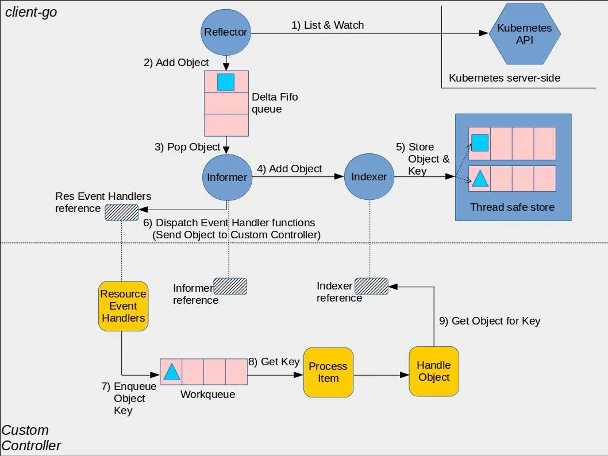

1. Reflector 执行ListAndWatch 监视 kubernetes API中指定的资源， 监视的资源可以是内置资源也可以是自定义资源， 当资源发生变化通过kubernetes API回收到通知，然后通过`WatchHandler`函数放到DeltaFIFO队列中。
2. Informer回从`DeltaFIFO`队列中弹出对象，执行此操作的函数是processLoop，然后保存对象以供后续get使用，并且调用控制将对象传递给他
3. Indexer， 根据对象标签创建索引， 索引器可以根据多个所以函数维护索引， 索引器使用线程安全的数据来存储对象及其键值，在`cache.Store`中定义了一个`MeteNamespaceKeyFunc`该函数生成的对象作为该对象的组合`<namespace>/<name>`